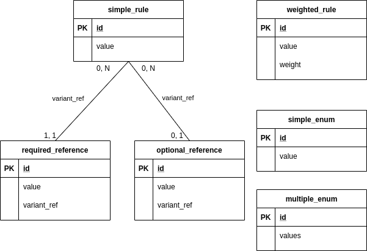
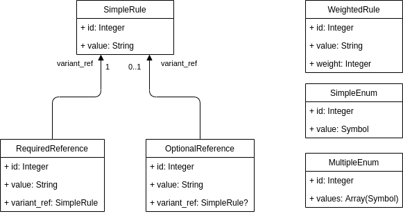

# `valid_dir1`

This directory contains rules to test basic behaviours regarding various data
types.

The rules are:

- `simple_rule`, a basic rule with a `value` field,
- `weighted_rule`, a weighted rule with a `weight` field to weight random
  choices,
- `optional_reference`, a rule with a `entity_ref` field targeting
  `simple_rule`, or not,
- `required_reference`, a rule with a `entity_ref` field imperatively targeting
  `simple_rule`,
- `simple_enum`, a rule whose attribute `value` has a predefined set of accepted
  values:
  - `value1`
  - `value2`
  - `value3`
- `multiple_enum`, whose attribute `values` contains a list of values from the
  set defined above.

Here is an entity-relationship representation of the set of rules:

And here is a class diagram representing the Ruby classes that must be inferred
from these rules:

