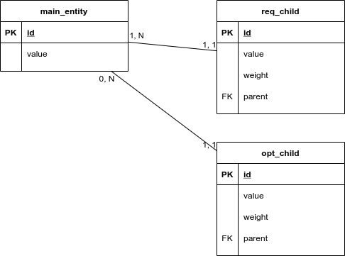
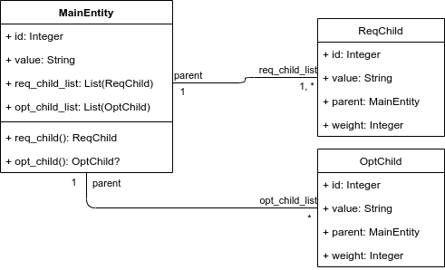

# `valid_dir2`

This directory contains rules to test 1:N relations.

These rules are:

- `main_entity`, whose entities possesses at least one `req_child` and zero or
  more `opt_child`;
- `req_child`, whose entities belongs to one `main_entity`’s entity;
- `opt_child`, whose entities belongs to one `main_entity`’s entity too.

Here is an entity-relationship representation of the set of rules:

And here is a class diagram representing the Ruby classes that must be inferred
from these rules:

